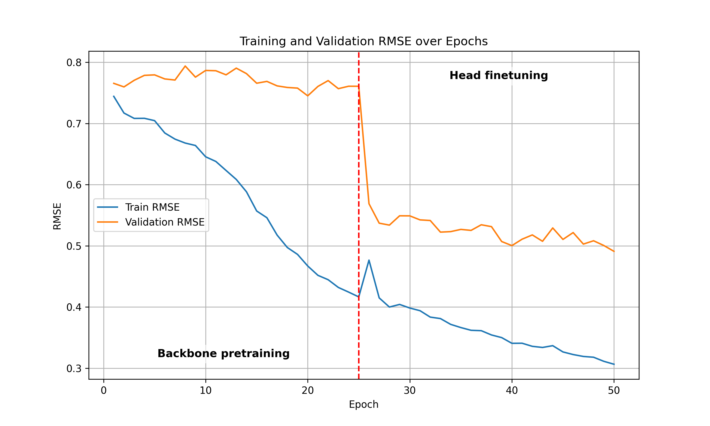
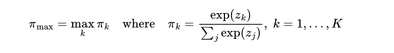
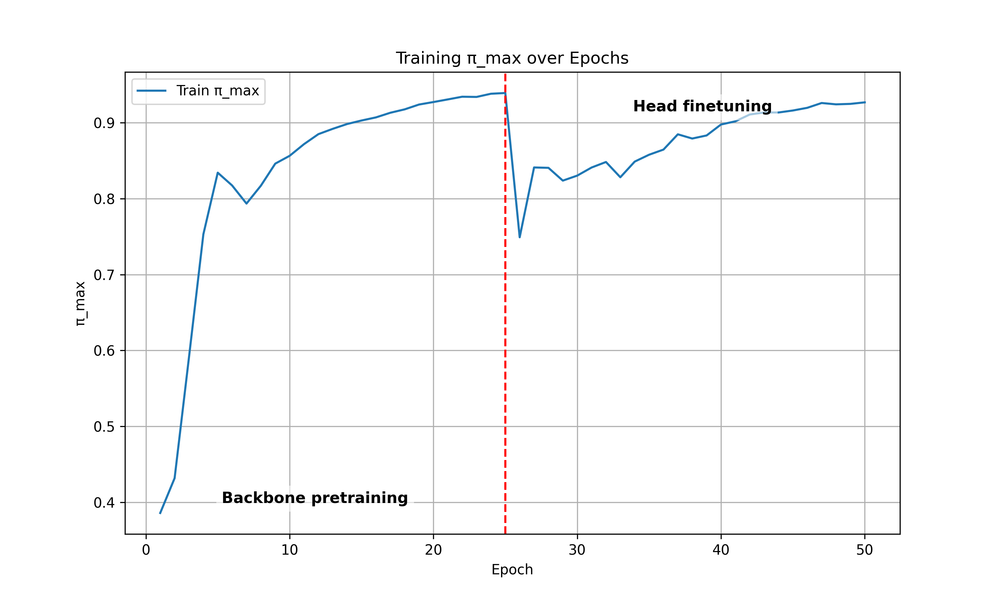
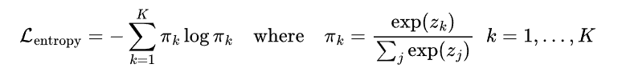
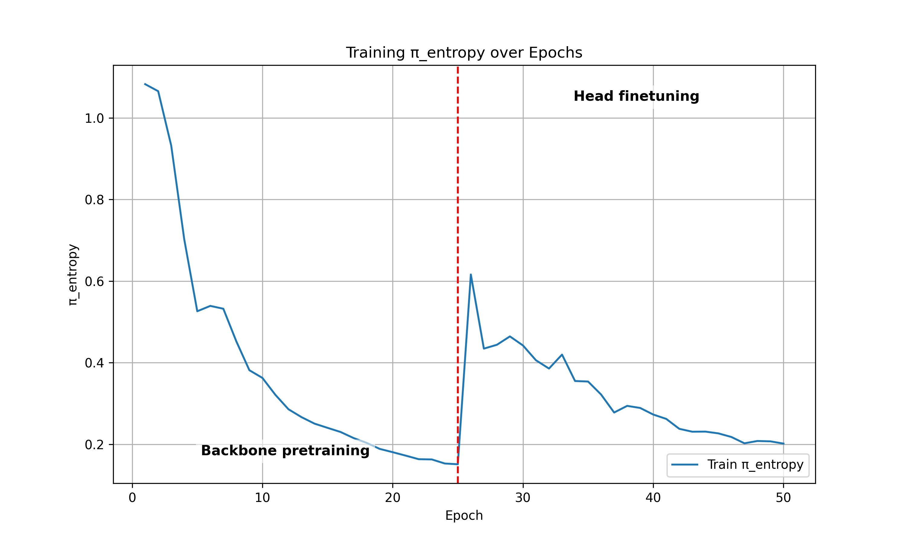

## Visualization

This is the visualization of the result of training model

1. Challenge 2: In the first 25 epochs, we combine the metadata to train and after that we just use only the EEG images for training 

- **RMSE between training and testing**. 

- **Pi Max (The maximum contribution of each mixture)**: This plot help to detect if the MDN suffers from model collapse (rely the prediction on one component only)

    The formula for that is:

    

    So it displays the $\max\pi_k$ 
    

- **Pi entropy:**

    The formula is:

    

    

